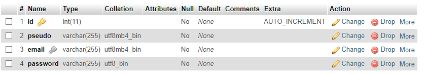
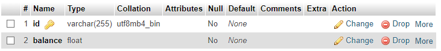
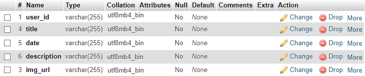

# User Management API

This project is an Express-based API for managing user accounts with features such as login, token verification, balance management, notifications, and notification deletion. It uses MySQL as the database backend.

## Features

- **Login/Signin**: Users can log in or sign up. Passwords are encrypted using bcrypt, and a token is returned upon successful authentication.
- **Token Verification**: Tokens are verified to ensure secure access to protected routes.
- **Balance Management**: Users can check their account balance.
- **Notifications**: Users can request notifications from the server.
- **Delete Notifications**: Users can delete specific notifications.

## Technologies

- **Backend**: Express.js
- **Database**: MySQL
- **Encryption**: bcrypt for password encryption
- **Token Management**: crypto-js for token handling

## Installation

1. **Clone the repository:**

    ```bash
    git clone https://github.com/RudyDinis/ExpressAPI-for-user-accounts.git
    ```

2. **Navigate to the project directory:**

    ```bash
    cd RudyDinis
    ```

3. **Install dependencies:**

    ```bash
    npm install
    ```

4. **Configure the database:**

    - Edit the `db.js` file with your MySQL database credentials.

    ```javascript
    // db.js
    const connection = mysql.createConnection({
      host: 'localhost',
      user: 'yourusername',
      password: 'yourpassword',
      database: 'yourdatabase'
    });

    ```

5. **Run the application:**

    ```bash
    node index.js
    ```

## Dependencies

- **bcrypt**: ^5.1.1
- **body-parser**: ^1.20.2
- **cors**: ^2.8.5
- **crypto-js**: ^4.2.0
- **express**: ^4.19.2
- **mysql**: ^2.18.1

## Screenshots

Here are screenshots for configuring the MySQL database:






